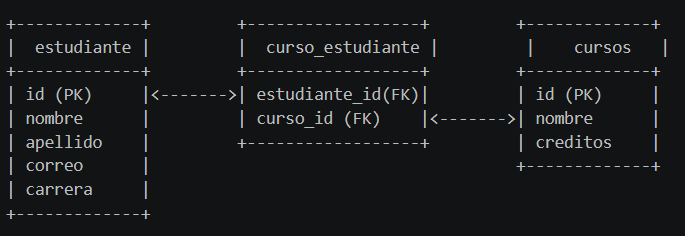
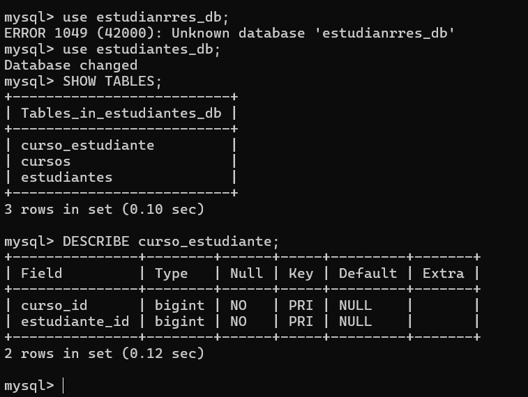
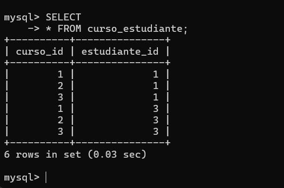
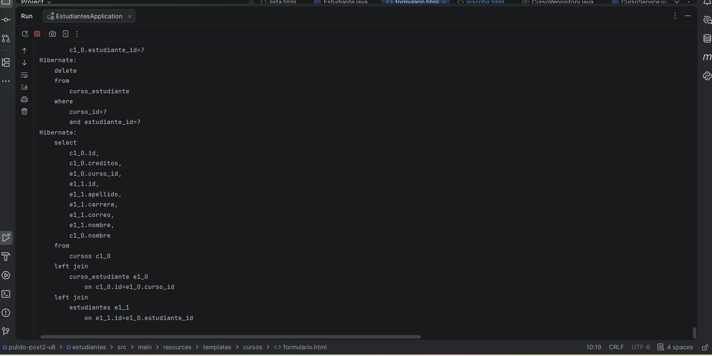

# Laboratorio - Persistencia con JPA/Hibernate
## Unidad 8 - Post-Contenido 2
**Estudiante:** Juan David Pulido  
**Materia:** Programación Web  
**Universidad Francisco de Paula Santander**

---

## Descripción
Implementación de relación @ManyToMany entre Curso y Estudiante 
usando Spring Data JPA, con tabla de unión curso_estudiante, 
métodos helper para sincronizar la relación bidireccional, 
y JOIN FETCH para evitar el problema N+1.

---

## Estructura de Entidades

### Estudiante
| Campo | Tipo | Descripción |
|-------|------|-------------|
| id | Long | Identificador único |
| nombre | String | Nombre del estudiante |
| apellido | String | Apellido del estudiante |
| correo | String | Correo único |
| carrera | String | Carrera que estudia |
| cursos | Set<Curso> | Cursos inscritos (lado inverso) |

### Curso
| Campo | Tipo | Descripción |
|-------|------|-------------|
| id | Long | Identificador único |
| nombre | String | Nombre del curso |
| creditos | int | Número de créditos |
| estudiantes | Set<Estudiante> | Estudiantes inscritos (lado propietario) |

---

## Diagrama ER - Relación @ManyToMany



---

## Configuración de MySQL

1. Crear la base de datos:
```sql
CREATE DATABASE estudiantes_db;
```

2. Configurar `application.properties`:
```properties
spring.datasource.url=jdbc:mysql://localhost:3306/estudiantes_db
spring.datasource.username=root
spring.datasource.password=TU_PASSWORD
spring.jpa.hibernate.ddl-auto=update
spring.jpa.show-sql=true
```

3. Hibernate crea automáticamente las tablas al iniciar.

---

## Cómo ejecutar

1. Clonar el repositorio
2. Configurar `application.properties` con tu contraseña de MySQL
3. Ejecutar `EstudiantesApplication.java`
4. Abrir `http://localhost:8080/estudiantes`

---

## Endpoints principales

| URL | Descripción |
|-----|-------------|
| /estudiantes | Lista de estudiantes |
| /cursos | Lista de cursos |
| /cursos/nuevo | Crear nuevo curso |
| /cursos/{id}/inscribir | Inscribir estudiante en curso |

---

## Verificación JOIN FETCH en consola

Al listar cursos, Hibernate ejecuta una sola consulta con JOIN:
```sql
select c1_0.id, c1_0.creditos, e1_0.curso_id, e1_1.id,
       e1_1.apellido, e1_1.carrera, e1_1.correo, e1_1.nombre,
       c1_0.nombre 
from cursos c1_0 
left join curso_estudiante e1_0 on c1_0.id=e1_0.curso_id 
left join estudiantes e1_1 on e1_1.id=e1_0.estudiante_id
```
Esto evita el problema N+1.

---

## Capturas
1. **Checkpoint 1**


2. **Checkpoint 2**


3. **Checkpoint 3**
